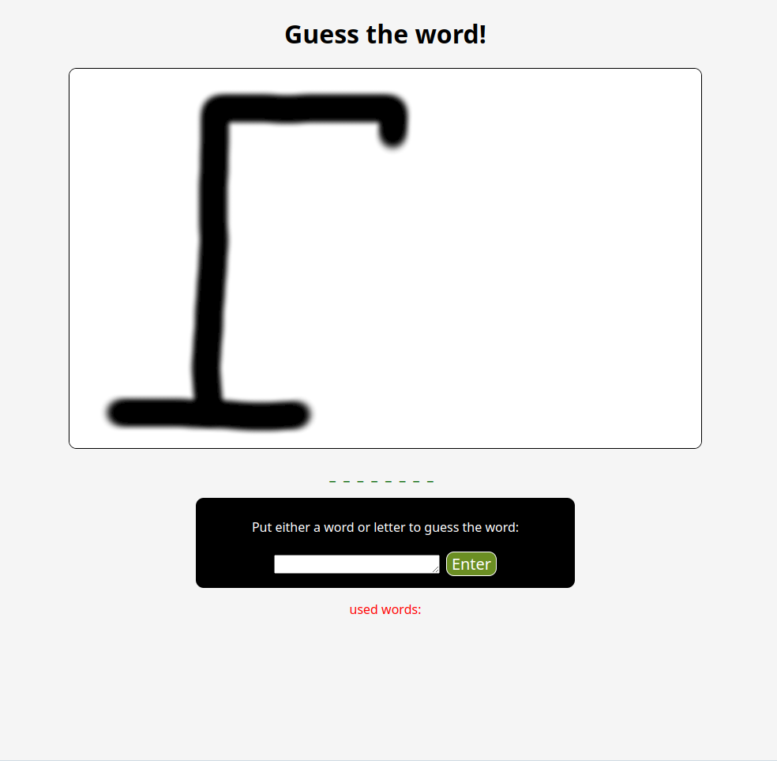

# Word Guesser

A very simple word guessing game that uses random words from a text file.

## Features

- display of used words.

- visual depiction of a hangman.

- \_'s for remaining letters left to guess.

## Technologies used

- Javascript, CSS, HTML

- A little bit of chatGPT for fetching the text file in JS.

## Application image

